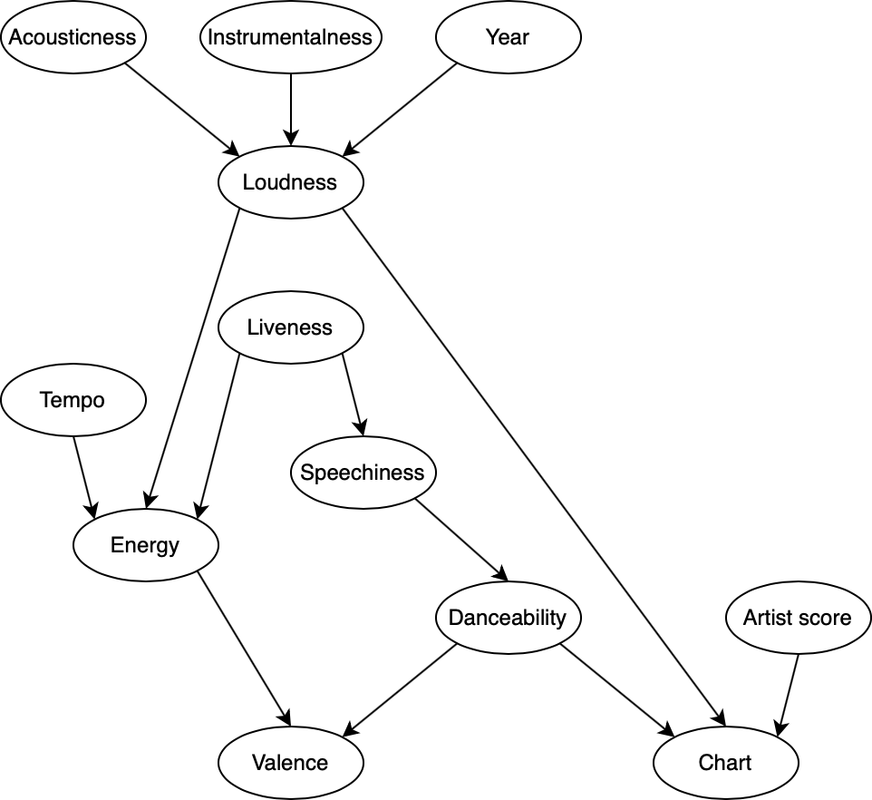

# Spotify audio features

The aim of this project is to apply probabilistic reasoning to a Bayesian Network created using audio features of songs on Spotify.



## Setup

```console
$ make setup
```

## Run

```console
$ jupyter notebook spotify-audio-features.ipynb
```

## Documentation

To browse documentation, open `docs/index.html` with a web browser.