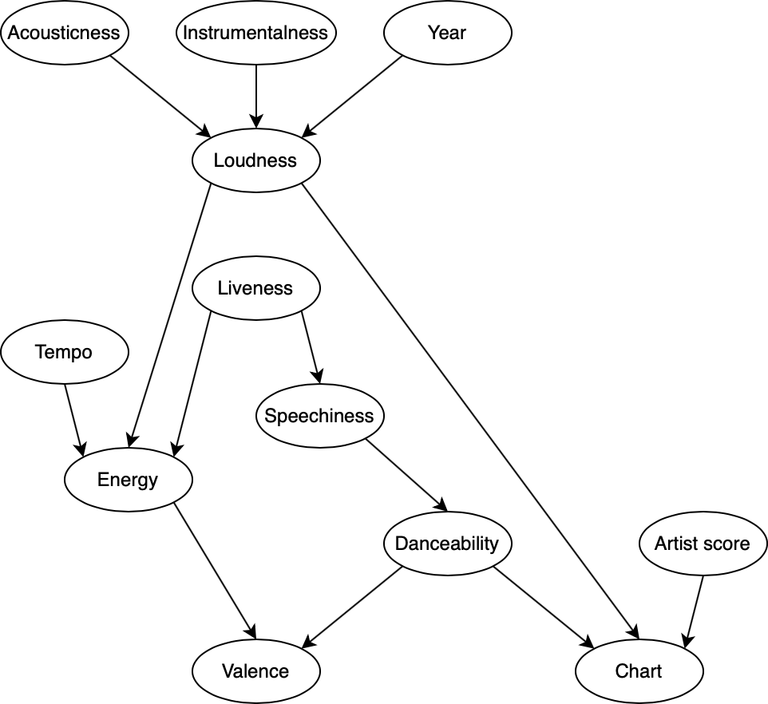
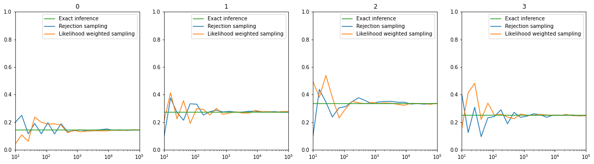
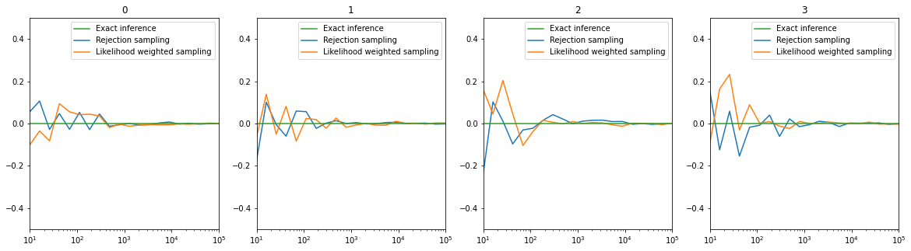

# Spotify audio features

The aim of this project is to apply probabilistic reasoning to a Bayesian Network created using audio features of songs on Spotify. Audio features are attributes which Spotify automatically calculates for each song in order to describe its mood and character.

In addition to Spotify audio features, the presence of each song in the Billboard Hot 100 Chart [1] is also taken into consideration.

Even though it is not the focus of the present work, using the Billboard data in association with the Spotify features might be particularly interesting, since it can give an insight about the characteristics which are more relevant in making a song a commercial success. For an in-depth analysis, a work by Elena Georgieva, Marcella Suta, and Nicholas Burton [2, 3] is suggested.

## Features

- Loudness: volume in dB
- Energy: perceived energy
- Danceability: regular and loud beat
- Acousticness: presence of acoustic instruments
- Valence: perceived cheerfulness
- Speechiness: amount of spoken words
- Instrumentalness: absence of voice
- Liveness: whether the song is performed live
- Tempo: beats per minute
- Chart: whether the song ended up in the Billboard Hot 100 Chart
- ArtistScore: whether the artist has had a previous hit

All features are expressed with a value ranging from 0 to 1, with the exception of loudness and tempo.

The data of both the Spotify features and the Billboard ones are taken from the .csv file included in the work by Elena Georgieva, Marcella Suta, and Nicholas Burton [2, 3].

## Bayesian network

In theory, a full joint probability distribution can be used to inspect any probabilistic query of the given data. However, the problem can easily become computationally intractable, given the very high number of possible worlds. In order to simplify the problem, it is possible to exploit the mutual independence of some variables and a Bayesian network can be created. A Bayesian network is "a directed graph in which each node is annotated with quantitative probability information" [4]. In other words, a direct influence relationship is supposed to exist only between nodes which are connected by an arrow. In this case, the structure of the diagram is created using both correlation analysis and human intuition in evaluating the causal links.



## Code

To start, the .csv file is imported as a pandas `DataFrame`. Then, in order to deal with the continuity of most of the variables, the data are discretized using the pandas `cut` function. The number of bins for the discretization is chosen to be 4, but it can be easily changed through the `BINS` value.

Next, a pgmpy `BayesianModel` is created specifying all the causal links shown in the network and it is then fit to the dataframe data using the `BayesianModel.fit` function.

### Conditional probability distributions

A conditional proability is given by the probability of a certin event given some prior knowledge. For example, one could ask the probability distribution of the Danceability variable, given that Speechiness is equal to 1, written as P(Danceability|Speechiness=1). Using the pgmpy package, CPDs can be calculated using the `BayesianModel.get_cpds` function: as an example, the Danceability CPD is shown.

| Speechiness     | 0     | 1     | 2     | 3     |
| --------------- | ----- | ----- | ----- | ----- |
| Danceability(0) | 0.052 | 0.018 | 0.063 | 0.000 |
| Danceability(1) | 0.264 | 0.113 | 0.125 | 0.304 |
| Danceability(2) | 0.508 | 0.411 | 0.688 | 0.522 |
| Danceability(3) | 0.176 | 0.458 | 0.125 | 0.174 |

However, the `BayesianModel.get_cpds` function can only return information of CPDs where the given state is made up of variables which are parents of the query variable. For example, if one wants to know the CPD of P(Valence|Chart=1), the `BayesianModel.get_cpds` would not work, since the CPD of the Valence variable uses its parents (i.e. Energy and Danceability) as conditioning variables. In order to compute CPD of other variable combinations, inference methods must be used.

### Variable independence

To efficiently calculate inferences, it is important to exploit variable indipendence. In general, "each variable is conditionally independent of its non-descendants, given its parents" [4]. For example, Danceability can be considered independent of Energy (a non-descendant), given Speechiness (its parent). This fact can be checked using the `BayesianModel.is_active_trail` function, which returns True if the variables are dependent and False if they are independent. The two lines
```python
print(model.is_active_trail('Danceability', 'Energy'))
print(model.is_active_trail('Danceability', 'Energy', observed='Speechiness'))
```
respectively print True and False, meaning that Danceability and Energy would not be independent if Speechiness were not given.

Another important property of Bayesian networks is that "a node is conditionally independent of all other nodes in the network, given its parents, children, and children’s parents" [4]. This group of variable is known as Markov blanket and can be computed through the `BayesianModel.get_markov_blanket` function: as an example, the Danceability Markov blanket returns the list `['ArtistScore', 'Energy', 'Chart', 'Speechiness', 'Valence', 'Loudness']`, whose correctness can be shown by looking at the network. The two lines
```python
print(model.is_active_trail('Danceability', 'Liveness'))
print(model.is_active_trail('Danceability', 'Liveness', observed=model.get_markov_blanket('Danceability')))
```
respectively print True and False, showing that Danceability and Liveness become independent when the Markov blanket for Danceability is given.

### Inferences

In this work, three different kinds of inference are tested and compared. The code used for each inference method can be found in the `functions.py` file.

The first method is exact inference, using in particular the variable elimination method, which consists in "do[ing] the calculation once and sav[ing] the results for later use" [4].

The second method is the rejection sampling method, an approximate inference algorithm which "generates samples from the prior distribution specified by the network" [4] and "rejects all those that do not match the evidence" [4].

The last algorithm is another approximate inference method, likelihood weighted sampling. This algortithm "avoids the inefficiency of rejection sampling by generating only events that are consistent with the evidence" [4].

The CPDs of P(Valence|Chart=1) computed using the three methods are shown in the following table.

|            | Exact | Rejection | Weighted |
| ---------- | ----- | --------- | -------- |
| Valence(0) | 0.143 | 0.150     | 0.150    |
| Valence(1) | 0.274 | 0.267     | 0.268    |
| Valence(2) | 0.334 | 0.337     | 0.336    |
| Valence(3) | 0.249 | 0.246     | 0.247    |

### Graphs

Since rejection sampling and likelihood weighted sampling are numerical computations, their accuracy depends on the number of samples which are calculated. To compare their performance with the exact values, two different graphs for P(Valence|Chart=1) are plotted. In both cases the x axis represents the number of samples in logarithmic scale, while the y axes of the two graphs show respectively the absolute probability and the difference from the exact value. The number at the top of each subplot represents a different Valence value. It is clear from the plots that as the sampling size increases the approximate estimation converge to the reference exact value, as expected.





## Bibliography

[1] Billboard Media. 2021. The Hot 100 Chart. (April 2001). Retrieved April 20, 2021 from https://www.billboard.com/charts/hot-100

[2] Elena Georgieva, Marcella Suta, and Nicholas Burton. 2018. HitPredict: Predicting Hit Songs Using Spotify Data. Retrieved April 20, 2021 from http://cs229.stanford.edu/proj2018/report/16.pdf

[3] Elena Georgieva, Marcella Suta, and Nicholas Burton. 2018. HitPredict: Using Spotify Data to Predict Billboard Hits. Retrieved April 20, 2021 from https://ccrma.stanford.edu/~egeorgie/HitPredict/ICML2020.pdf

[4] Stuart J. Russell and Peter Norvig. 2010. *Artificial Intelligence: A Modern Approach* (3rd. ed.). PearsonEducation, Upper Saddle River, New Jersey.